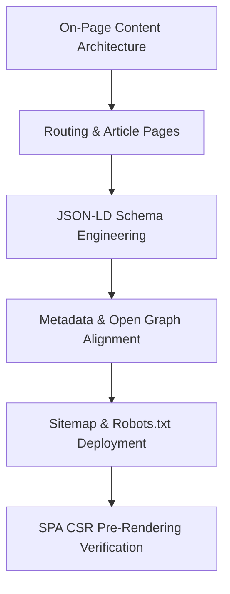
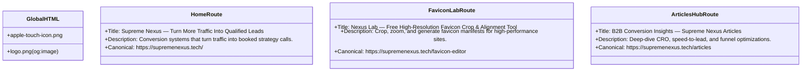

# SEO, AEO, and GEO Strategic Implementation Plan

This blueprint details the complete technical specifications and step-by-step roadmap to optimize the **Supreme Nexus** web platform. This design addresses traditional Search Engine Optimization (SEO), Answer Engine Optimization (AEO), and Generative Engine Optimization (GEO).

---

## 📅 Chronology of Operations



---

## 📝 Execution Checklist

- [x] **1. On-Page Content Architecture**
  - [x] 1.1 Landing Page FAQs (10 Optimized Items)
  - [x] 1.2 The Articles Component & Pages (`/articles`)
  - [x] 1.3 Footer "Freshness" Signal
- [x] **2. In-Code Structured Data Injection (JSON-LD)**
- [ ] **3. Metadata & Page Audit Setup**
- [ ] **4. Complete Sitemap Mapping (`sitemap.xml`)**
- [ ] **5. Gatekeeping Rules (`robots.txt`)**
- [ ] **6. SPA Pre-rendering Setup**

---

## 1. On-Page Content Architecture

### 1.1 Landing Page FAQs (10 Optimized Items)
We will expand the landing page FAQ dataset to **10 items**, merging B2B sales objectives with high-intent conversational queries designed to trigger AI search engine citations.

| FAQ # | Question | Core Search Objective / Intent |
| :--- | :--- | :--- |
| **01** | *Who is this for?* | Customer profile & audience identification. |
| **02** | *How fast can we start?* | Operations speed & delivery window constraints. |
| **03** | *Do you work with existing funnels and websites?* | Rebuild vs. greenfield engineering qualifications. |
| **04** | *What kind of businesses benefit most?* | B2B, coaching, and appointment-centric profiles. |
| **05** | *What happens on the strategy call?* | Frictionless booking expectations. |
| **06** | *What is a conversion leak in a sales funnel, and how do you identify it?* | **AEO/GEO**: Provides high factual density definition for "funnel leakage". |
| **07** | *How does Supreme Nexus increase landing page conversion rates without changing our traffic source?* | **GEO**: Clarifies CRO strategy, copy alignment, and optimization levers. |
| **08** | *Why does lead response time matter for B2B pipeline velocity?* | **AEO/GEO**: Validates stats regarding pipeline speed-to-lead statistics. |
| **09** | *What is the difference between traffic acquisition and funnel optimization?* | **SEO**: Captures transactional informational queries comparing acquisition to optimization. |
| **10** | *What key performance indicators (KPIs) do you track during an engagement?* | **GEO**: Showcases factual metrics (LP CVR, response latency, SQL rate). |

---

### 1.2 The Articles Component (`/articles`)
We will create a dedicated route for articles.
*   **Path**: `src/routes/articles.tsx` (Serving as the Articles hub list).
*   **Detailed Static Sub-routes**:
    *   `/articles/leaky-bucket-funnels`
    *   `/articles/speed-to-lead-mathematics`
    *   `/articles/frictionless-form-design`
*   **Aesthetics**: Follows the existing dark mode, glassmorphism, frosted card grids, and smooth scroll animations (`framer-motion`) present on the homepage.

#### Static Article Specifications:
1.  **Article 1: "The Leaky Bucket: How B2B Funnels Lose 60%+ of Qualified Leads"**
    *   *Focus*: Factual, content-dense analysis of drop-off points, opt-in friction, and message-to-offer gaps.
    *   *SEO Target*: "B2B funnel leaks", "funnel conversion rate improvements".
2.  **Article 2: "Speed to Lead: The Mathematics of the 5-Minute Response Window"**
    *   *Focus*: Quantitative statistical breakdowns of response speed impact on pipeline conversion. Backed by industry metrics showing a 391% lift in response rate if contacted within 5 minutes.
    *   *SEO Target*: "B2B speed to lead statistics", "lead response time optimization".
3.  **Article 3: "Frictionless Conversion: Redesigning Forms for Maximum Lead Quality"**
    *   *Focus*: Practical form design rules, multi-step optimization, cognitive load reduction, and progressive profiling.
    *   *SEO Target*: "Form optimization CRO", "frictionless lead forms".

---

### 1.3 Footer "Freshness" Signal
We will implement a clean, visible, and dynamic last updated and verified date in the bottom of [Footer](file:///c:/BUSINESS/Supreme%20Nexus/GitHub%20Repository/supreme-nexus-tech-main/src/routes/index.tsx#L1566-L1590):
```tsx
<span className="font-mono text-[10px] uppercase tracking-[0.18em] text-white/40">
  © {new Date().getFullYear()} Supreme Nexus · Content Verified & Updated for Q2 {new Date().getFullYear()}
</span>
```
This feeds fresh active dates directly to generative models scanning the DOM.

---

## 2. In-Code Structured Data Injection (JSON-LD)

We will inject a script block into the main layouts using React's ability to render custom `<script>` blocks or TanStack's `head` mechanism.

```json
{
  "@context": "https://schema.org",
  "@graph": [
    {
      "@type": "ProfessionalService",
      "@id": "https://supremenexus.tech/#service",
      "name": "Supreme Nexus",
      "url": "https://supremenexus.tech",
      "logo": "https://supremenexus.tech/logo.png",
      "image": "https://supremenexus.tech/logo.png",
      "description": "Supreme Nexus builds conversion systems that turn traffic into qualified leads, pipeline velocity, and booked strategy calls.",
      "address": {
        "@type": "PostalAddress",
        "addressCountry": "US"
      },
      "knowsAbout": [
        "Conversion Rate Optimization",
        "Lead Generation Systems",
        "Funnel Optimization",
        "B2B Growth Marketing",
        "Appointment Setting Automation"
      ]
    },
    {
      "@type": "FAQPage",
      "@id": "https://supremenexus.tech/#faq",
      "mainEntity": [
        {
          "@type": "Question",
          "name": "What is a conversion leak in a sales funnel, and how do you identify it?",
          "acceptedAnswer": {
            "@type": "Answer",
            "text": "A conversion leak is any point in a marketing or sales funnel where qualified prospects drop off instead of taking the next action. Supreme Nexus identifies leaks through empirical conversion tracking audits, form analytics, user behavior analysis, and lifecycle messaging speed audits."
          }
        }
        // Additional 9 FAQs mapped out in full here
      ]
    }
  ]
}
```

---

## 3. Metadata & Page Audit Setup

### 3.1 Metadata Inventory & Optimizations
We will configure matching `<title>`, `<meta name="description">`, `<meta property="og:image">`, and `<link rel="canonical">` configurations across all active route branches.



*   **Open Graph Image Verification**: Verified that `/logo.png` and `/logo-transparent.png` are present in `/public`. We will utilize `/logo.png` as our global `og:image` property fallback.
*   **Canonical Links**: We will dynamic-render:
    ```tsx
    <link rel="canonical" href={`https://supremenexus.tech${window.location.pathname}`} />
    ```

---

## 4. Complete Sitemap Mapping

A static, dynamic-ready [sitemap.xml](file:///c:/BUSINESS/Supreme%20Nexus/GitHub%20Repository/supreme-nexus-tech-main/public/sitemap.xml) will be stored in `/public` mapping **all pages**:

```xml
<?xml version="1.0" encoding="UTF-8"?>
<urlset xmlns="http://www.sitemaps.org/schemas/sitemap/0.9">
  <!-- Home Landing Page -->
  <url>
    <loc>https://supremenexus.tech/</loc>
    <lastmod>2026-05-30</lastmod>
    <changefreq>weekly</changefreq>
    <priority>1.0</priority>
  </url>
  <!-- Favicon Lab Tool -->
  <url>
    <loc>https://supremenexus.tech/favicon-editor</loc>
    <lastmod>2026-05-30</lastmod>
    <changefreq>monthly</changefreq>
    <priority>0.6</priority>
  </url>
  <!-- Articles Hub -->
  <url>
    <loc>https://supremenexus.tech/articles</loc>
    <lastmod>2026-05-30</lastmod>
    <changefreq>weekly</changefreq>
    <priority>0.8</priority>
  </url>
  <!-- Article 1: Funnel Leaks -->
  <url>
    <loc>https://supremenexus.tech/articles/leaky-bucket-funnels</loc>
    <lastmod>2026-05-30</lastmod>
    <changefreq>monthly</changefreq>
    <priority>0.7</priority>
  </url>
  <!-- Article 2: Speed to Lead -->
  <url>
    <loc>https://supremenexus.tech/articles/speed-to-lead-mathematics</loc>
    <lastmod>2026-05-30</lastmod>
    <changefreq>monthly</changefreq>
    <priority>0.7</priority>
  </url>
  <!-- Article 3: Frictionless Forms -->
  <url>
    <loc>https://supremenexus.tech/articles/frictionless-form-design</loc>
    <lastmod>2026-05-30</lastmod>
    <changefreq>monthly</changefreq>
    <priority>0.7</priority>
  </url>
</urlset>
```

---

## 5. Gatekeeping Rules (robots.txt)

We will publish a customized [robots.txt](file:///c:/BUSINESS/Supreme%20Nexus/GitHub%20Repository/supreme-nexus-tech-main/public/robots.txt) allowing all major search engine spiders and AI indexing bots while preventing crawling of internal build outputs:

```text
User-agent: *
Allow: /
Disallow: /dist/
Disallow: /node_modules/

# Welcoming and optimizing for AI GEO Indexers
User-agent: GPTBot
Allow: /

User-agent: ClaudeBot
Allow: /

User-agent: PerplexityBot
Allow: /

User-agent: Google-Extended
Allow: /

# Sitemap Target
Sitemap: https://supremenexus.tech/sitemap.xml
```

---

## ⚠️ The SPA Caveat: Mitigation Strategy

> [!WARNING]
> **Vite SPA (Client-Side Rendering) Challenge**:
> A raw Vite Client-Side Rendered (CSR) app loads a minimal, shell HTML page (`<div id="root"></div>`) and relies on React to hydrate the DOM. 
> While Googlebot executes JavaScript, many AI scrapers (e.g. Perplexity, ChatGPT Search, Bing AI) and older search indexing bots use simplified, static scrapers that **do not run JavaScript**. Consequently, they may see a completely blank page, failing your SEO, AEO, and GEO objectives!

### Our Recommended Approach: Pre-rendering (Static Generation)

To combat this without rewriting the app to a complex server-side-rendered setup (like TanStack Start server components), we propose **Build-time Static Pre-rendering**. 

#### How we will implement this:
1.  **Meta-data Injection inside `index.html`**:
    *   We will ensure baseline semantic descriptors, Open Graph cards, and our high-priority JSON-LD scripts are declared statically inside [index.html](file:///c:/BUSINESS/Supreme%20Nexus/GitHub%20Repository/supreme-nexus-tech-main/index.html).
    *   This guarantees that even the simplest, non-JS crawl engine instantly parses the structured schemas and organization details of Supreme Nexus.
2.  **SSG Build Configuration**:
    *   We will leverage static export utilities or build configuration routines inside [vite.config.ts](file:///c:/BUSINESS/Supreme%20Nexus/GitHub%20Repository/supreme-nexus-tech-main/vite.config.ts) to pre-render the pages.
    *   For hosting on Vercel (indicated by your `vercel.json` SPA configuration), this ensures search engines crawl fully compiled structural HTML files for `/`, `/favicon-editor`, and all `/articles/*` pages instead of landing on a blank JS shell.
